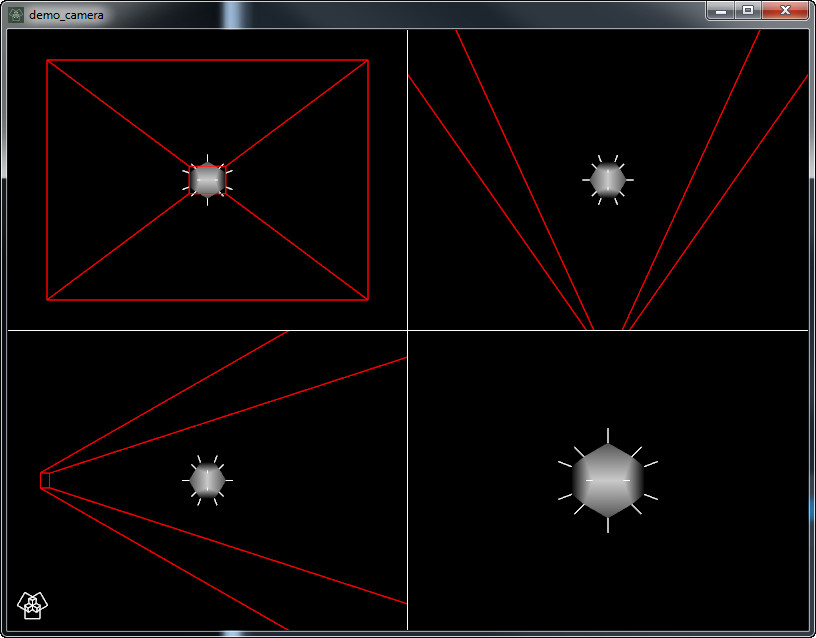
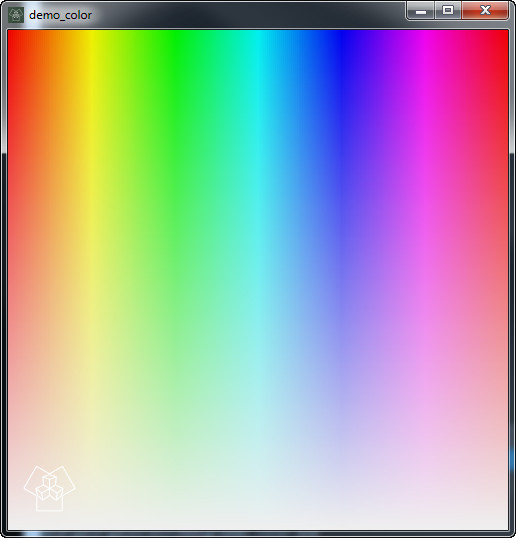
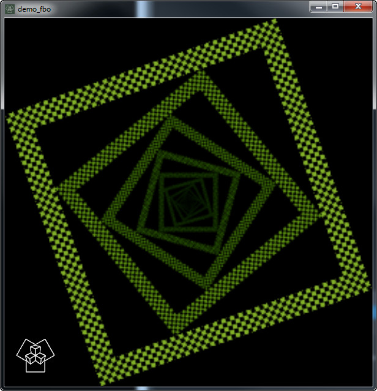
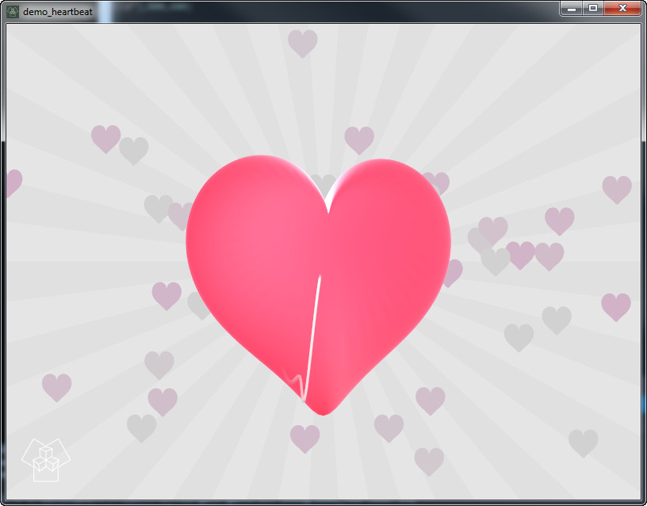
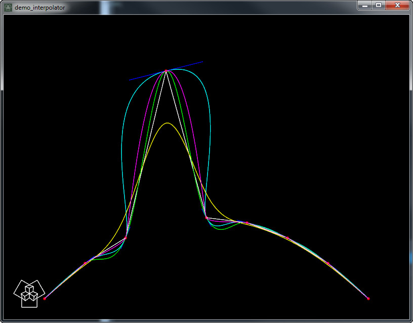
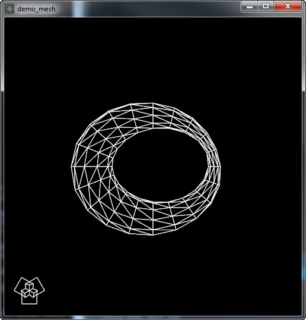
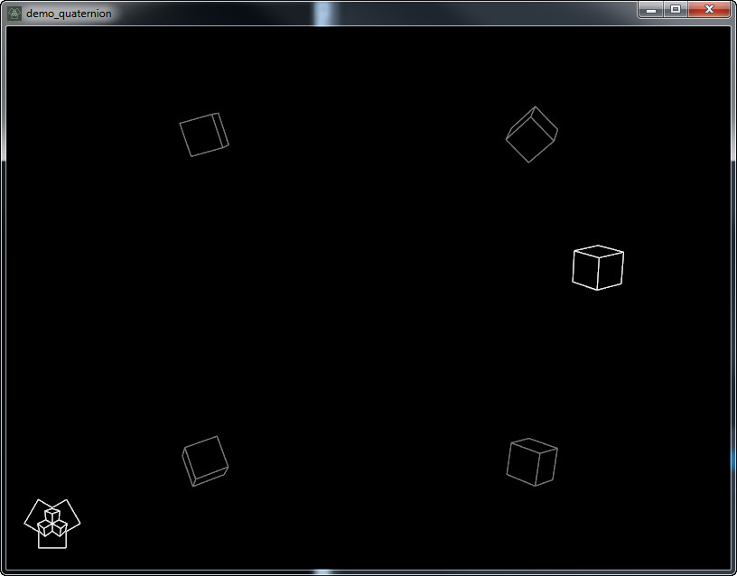
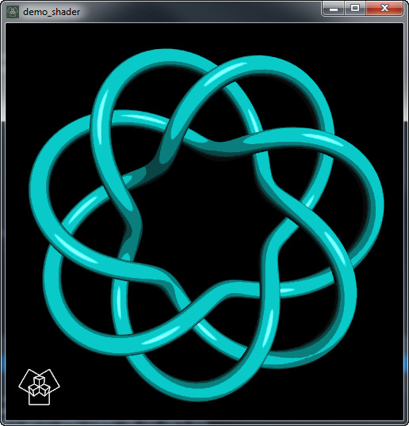
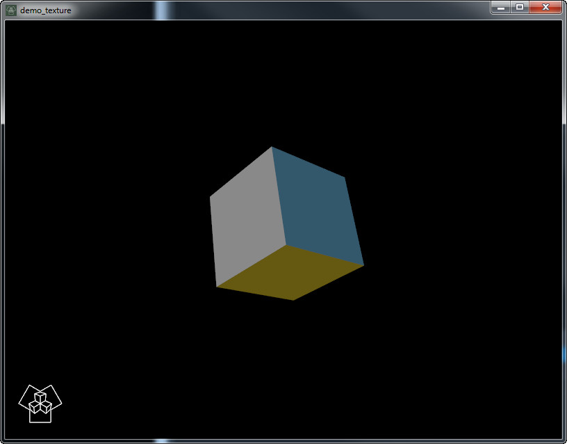

# Introduction

The "Graphics Abstraction Layer & Engine" (GALE) is an object oriented wrapper around OpenGL and its extensions. It is designed to be modern, lightweight and self-consistent (there is no CRT dependency). Typical targets are small graphical applications. You can probably think of it as something similar to (but far less extensive than) the great <a href="http://www.geometrictools.com/">Wild Magic</a> and <a href="http://g3d.sourceforge.net/">G3D Innovation Engine</a> libraries, with a bit of <a href="http://glew.sourceforge.net/">GLEW</a> and <a href="http://glm.g-truc.net/">GLM</a>, however with a focus on very compact programs.

The current version of the C++ library is <a href="https://github.com/sschuberth/gale/tree/master/gale2">GALE 2</a>, a complete rewrite of the abandoned GALE 1 which was previously hosted in SVN at SourceForge. GALE 2 has all new OpenGL wrappers and <a href="http://en.wikipedia.org/wiki/Polygon_mesh#Vertex-vertex_meshes">vertex-vertex mesh</a> classes with <a href="http://en.wikipedia.org/wiki/Subdivision_surface">subdivision</a> support. It makes heavy use of (meta-)templates for more generic code, better performance, as well as smaller code size, and also comes with minimal CRT replacement routines.
Not all of the GALE 1 functionality is available in GALE 2 yet (e.g. images and billboards), but on the other hand GALE 2 already provides a lot of functionality not available in GALE 1, like <a href="http://threekings.tk/gale/classgale_1_1wrapgl_1_1_frame_buffer_object.html">Frame Buffer Object wrappers</a> and <a href="http://threekings.tk/gale/classgale_1_1math_1_1_interpolator.html">interpolator classes</a>.

For building GALE 2, please refer to the <a href="https://github.com/sschuberth/gale/blob/master/gale2/prerequisites.txt">prerequisites</a>.

There also is a sub-project called GLEX, an OpenGL Extension Specification Parser, which is used to turn OpenGL extension specification files into a set of compact C source files that can be easily included into existing projects to initialize only the desired extension or core API function pointers. GLEX **version 2** parses the database `*.spec` / `*.tm` files which are linked from the <a href="http://www.opengl.org/registry/">OpenGL Registry</a>. As GLEX is written in PHP, it can be easily used from both the command line and via a web front-end.

Please try out <a href="http://threekings.tk/gale/glex2/">GLEX 2 online</a>.

# Screenshots

# TODO

* Implement demo_distfield.
* Leverage [Read The Docs](https://readthedocs.org/) (via [Breathe](https://breathe.readthedocs.org/)).
